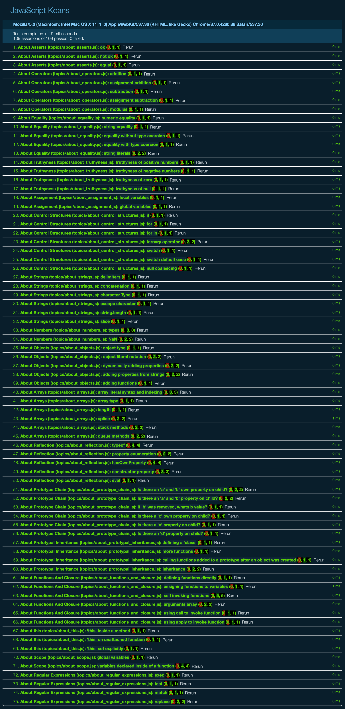

# JavaScript Koans (by Liam McLennan)

JavaScript Koans is an interactive learning environment that uses failing tests to introduce students to aspects of JavaScript in a logical sequence. 

The inspiration for this project comes from the Edgecase Ruby Koans and the book 'Javascript: The Good Parts'.

Open the file jskoans.htm in your favourite browser and make the tests pass.

The koans use the [Qunit](http://qunitjs.com/) test syntax and test runner. 

Get started with Ryan Anklam's [Learn JavaScript completely On the Cloud With the JavaScript Koans and Cloud9 IDE](http://blog.bittersweetryan.com/2011/08/learn-some-javascript-completely-on.html)

## Completed

  * Screenshot with all test passed is added (2021-01-17)
